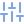

<div align="center">
  
</div>

<br/>

<div align="center">
  <a href="https://linkedin.com/in/iamrudhresh"></a>&nbsp;
  <a href="https://x.com/iamrudhresh"></a>&nbsp;
  <a href="https://medium.com/@iamrudhresh"></a>&nbsp;
  <a href="https://bsky.app/profile/iamrudhresh"></a>&nbsp;
  <a href="https://instagram.com/iamrudhresh"></a>&nbsp;
  <a href="https://youtube.com/@iamrudhresh"></a>&nbsp;
  <a href="mailto:officialrudhresh@gmail.com"></a>
</div>

<br/>

<div align="center">
  <a href="#-about-me"></a>&nbsp;
  <a href="#-experience--milestones"></a>&nbsp;
  <a href="#-core-expertise"></a>&nbsp;
  <a href="#-technical-arsenal"></a>&nbsp;
  <a href="#-featured-repositories"></a>&nbsp;
  <a href="#-github-analytics--insights"></a>&nbsp;
  <a href="#-connect--collaborate"></a>
</div>

<br/>

<p align="center">
  
</p>

---

##  About Me

```yaml
developer:
  name: Rudhresh
  role: Gen AI Developer @ BMW Techworks India
  core_focus: Generative AI × Full-Stack Architecture × Cloud Systems
  current_initiatives: Enterprise AI Agents, Multi-Modal Systems, Scalable Cloud APIs
  continuous_learning: Distributed Systems, Advanced Agent Orchestration, MLOps
```

- **Engineering Philosophy:** Designing thoughtful digital experiences backed by clean code and scalable AI-driven architecture.
- **Production AI:** Building robust LLM orchestration workflows, multi-agent frameworks, and retrieval-augmented generation (RAG) systems.
- **Full-Stack Craft:** Engineering end-to-end applications with TypeScript, React/Next.js, high-throughput Node.js/Python backends, and resilient databases.
- **Cloud & DevOps Mindset:** Automating workflows with containerization, declarative infrastructure, CI/CD pipelines, and active monitoring.
- **Knowledge Sharing:** Publishing technical tutorials, architectural breakdowns, and engineering guides on [Medium](https://iamrudhresh.medium.com/).

---

##  Experience & Milestones

<table width="100%">
  <tr>
    <td width="50%" valign="top">
      <h4>🏢 Gen AI Developer</h4>
      <p><b>BMW Techworks India</b> • <i>Present</i></p>
      <p>Architecting enterprise Generative AI workflows, multi-agent LLM orchestration, intelligent automation pipelines, and scalable cloud services.</p>
    </td>
    <td width="50%" valign="top">
      <h4>🎓 Technical Community & Leadership</h4>
      <p><b>Microsoft Learn Student Ambassador (MLSA)</b></p>
      <p>Mentoring emerging engineers, delivering technical workshops on cloud and modern web stacks, and authoring developer deep-dives on Medium.</p>
    </td>
  </tr>
</table>

---

##  Core Expertise

<table width="100%">
  <tr>
    <td width="33.3%" valign="top">
      <h3 align="center">🧠 Generative & Agentic AI</h3>
      <p align="center">
        Multi-Agent Systems • LLM Tool Calling • RAG Pipelines • Vector Search • Prompt Engineering • LangGraph & CrewAI
      </p>
    </td>
    <td width="33.3%" valign="top">
      <h3 align="center">⚡ Full-Stack Systems</h3>
      <p align="center">
        Modern React & Next.js • High-Performance REST & GraphQL • TypeScript / Python / Java • Distributed Caching & SQL/NoSQL
      </p>
    </td>
    <td width="33.3%" valign="top">
      <h3 align="center">☁️ Cloud & Automation</h3>
      <p align="center">
        AWS & Azure Cloud • Docker Containers • Kubernetes • CI/CD Workflows • Infrastructure as Code • Observability
      </p>
    </td>
  </tr>
</table>

---

##  Current Focus & Tech Radar

<table width="100%">
  <tr>
    <td width="33.3%" valign="top">
      <h4 align="center">🎯 Building</h4>
      <ul>
        <li>Autonomous Multi-Agent Networks (MCP & A2A)</li>
        <li>Production-grade RAG with Hybrid Retrieval</li>
        <li>Resilient event-driven microservices</li>
      </ul>
    </td>
    <td width="33.3%" valign="top">
      <h4 align="center">🔬 Exploring</h4>
      <ul>
        <li>Fine-tuning SLMs (Llama 3, Mistral, Phi)</li>
        <li>Agent evaluation & observability frameworks</li>
        <li>High-throughput backend systems</li>
      </ul>
    </td>
    <td width="33.3%" valign="top">
      <h4 align="center">📚 Sharing</h4>
      <ul>
        <li>System Design patterns & CAP trade-offs</li>
        <li>LLM reasoning protocols & graph agents</li>
        <li>Technical deep-dives on Medium & LinkedIn</li>
      </ul>
    </td>
  </tr>
</table>

---

##  Technical Arsenal

###  AI & Intelligent Systems

<details open>
<summary> <b>Gen AI & LLM Providers</b></summary>
<br/>
<p>
  
  
  
  
  
  
  
  
</p>
</details>

<details open>
<summary> <b>Agentic AI & Orchestration</b></summary>
<br/>
<p>
  
  
  
  
  
  
  
  
</p>
</details>

<details open>
<summary> <b>Vector DBs & RAG</b></summary>
<br/>
<p>
  
  
  
  
  
</p>
</details>

<details open>
<summary> <b>AI App Builders & MLOps</b></summary>
<br/>
<p>
  
  
  
  
  
</p>
</details>

<details open>
<summary> <b>AI / ML / DL Frameworks</b></summary>
<br/>
<p>
  
  
  
  
  
  
  
  
</p>
</details>

<details open>
<summary> <b>Data Science & Visualization</b></summary>
<br/>
<p>
  
  
  
  
  
  
</p>
</details>

---

###  Full-Stack Development

<details open>
<summary> <b>Languages</b></summary>
<br/>
<p>
  
  
  
  
  
  
  
  
  
  
  
  
</p>
</details>

<details open>
<summary> <b>Frontend</b></summary>
<br/>
<p>
  
  
  
  
  
  
  
  
  
  
</p>
</details>

<details open>
<summary> <b>Backend & APIs</b></summary>
<br/>
<p>
  
  
  
  
  
  
  
  
  
  
  
</p>
</details>

<details open>
<summary> <b>Databases</b></summary>
<br/>
<p>
  
  
  
  
  
  
  
</p>
</details>

---

###  Cloud & Infrastructure

<details open>
<summary> <b>Cloud Providers</b></summary>
<br/>
<p>
  
  
  
  
</p>
</details>

<details open>
<summary> <b>Hosting & Deployment</b></summary>
<br/>
<p>
  
  
  
  
  
</p>
</details>

---

###  DevOps & Automation

<details open>
<summary> <b>Containers & Orchestration</b></summary>
<br/>
<p>
  
  
  
</p>
</details>

<details open>
<summary> <b>IaC & CI/CD</b></summary>
<br/>
<p>
  
  
  
  
</p>
</details>

<details open>
<summary> <b>Monitoring & Networking</b></summary>
<br/>
<p>
  
  
  
</p>
</details>

---

###  Tools & Design Ecosystem

<details open>
<summary> <b>Developer Tools & Workflows</b></summary>
<br/>
<p>
  
  
  
  
  
</p>
</details>

---

##  Featured Repositories

<div align="center">
  <a href="https://github.com/iamrudhresh/NPTEL-JAVA-PROGRAMMING">
    
  </a>
  <a href="https://github.com/iamrudhresh/GeeksforGeeks">
    
  </a>
</div>

<br/>

<div align="center">
  <a href="https://github.com/iamrudhresh/LeetCode">
    
  </a>
  <a href="https://github.com/iamrudhresh/devtinder-backend">
    
  </a>
</div>

---

##  GitHub Analytics & Insights

<div align="center">
  
  
</div>

<br/>

<div align="center">
  
</div>

---

##  Contribution Activity

<div align="center">
  <picture>
    <source media="(prefers-color-scheme: dark)" srcset="https://raw.githubusercontent.com/iamrudhresh/iamrudhresh/output/github-contribution-grid-snake-dark.svg" />
    <source media="(prefers-color-scheme: light)" srcset="https://raw.githubusercontent.com/iamrudhresh/iamrudhresh/output/github-contribution-grid-snake.svg" />
    
  </picture>
</div>

---

##  Verified Badges & Achievements

<div align="center">
  <a href="https://holopin.io/@iamrudhresh" target="_blank">
    
  </a>
</div>

---

##  Technical Writing & Insights

<div align="center">
  <a href="https://iamrudhresh.medium.com/" target="_blank">
    
  </a>
</div>

<br/>

<div align="center">

| Featured Publication | Topic | Platform |
|:---|:---|:---:|
| 📖 [How to apply for Microsoft Learn Student Ambassador (MLSA) Program](https://medium.com/@iamrudhresh?source=rss-56d060a8c010------2) | Tech Community & Leadership | [Medium](https://iamrudhresh.medium.com/) |

</div>

---

##  Workspace & Daily Drivers

<div align="center">
  &nbsp;
  &nbsp;
  &nbsp;
  
</div>

---

##  Dev Quote

<div align="center">
  
</div>

---

##  Connect & Collaborate

<div align="center">

| | |
|:---|:---|
|  **Portfolio** | [iamrudhresh.com](https://iamrudhresh.com) |
|  **Resume** | [View Resume](https://drive.google.com/file/d/1nCwNRfuMxGm5b98b368mBZGUwr0yOuJh/view?usp=sharing) |
|  **Blog** | [iamrudhresh.medium.com](https://iamrudhresh.medium.com/) |
|  **Email** | [officialrudhresh@gmail.com](mailto:officialrudhresh@gmail.com) |

</div>

---

##  Support My Work

<div align="center">
  <a href="https://buymeacoffee.com/iamrudhresh"></a>&nbsp;
  <a href="https://paypal.me/iamrudhresh"></a>&nbsp;
  <a href="https://ko-fi.com/iamrudhresh"></a>
</div>

<br/>


